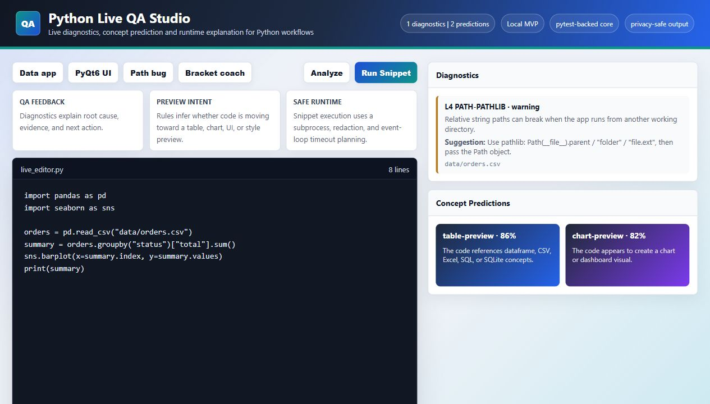
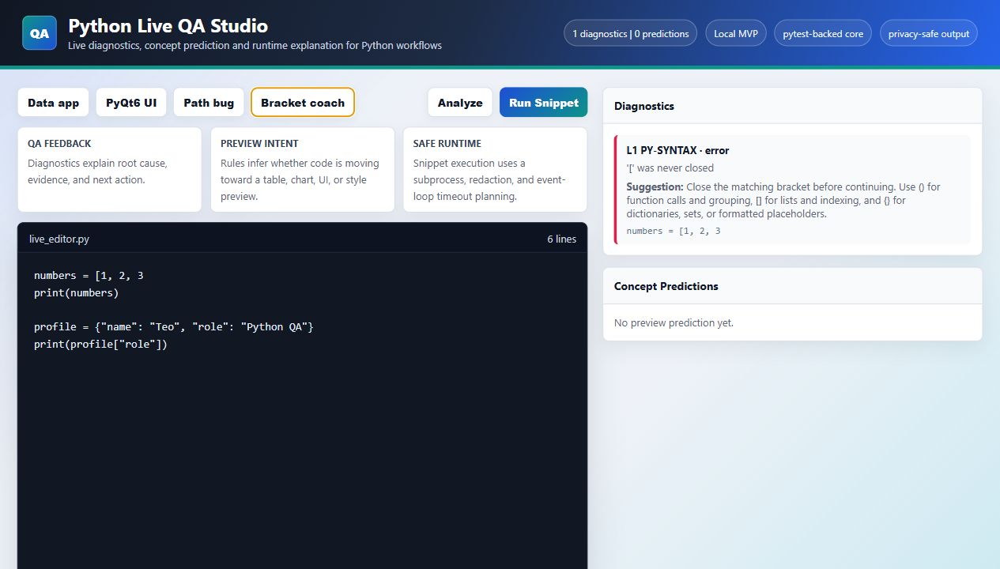

# Python Live QA Studio

Portfolio project for live Python diagnostics, QA-oriented code feedback, and visual preview workflows.

This project is my developer-tooling prototype for code quality, debugging, testability, and clear Python feedback. The core behavior stays visible through deterministic rules, tests, and documentation.



## Project Vision

Python Live QA Studio is an experimental developer tool for writing Python with faster feedback.

Instead of writing code, pressing Run, reading a traceback, and guessing the fix, the tool is designed to:

- analyze code while it is being written;
- explain errors in plain engineering language;
- suggest safer alternatives, such as `pathlib` for file paths;
- predict the likely preview a programmer needs next;
- support UI and data work such as PyQt6, Tkinter, pandas, matplotlib, seaborn, and SQLite workflows;
- keep every prediction testable and documented.

The first milestone is intentionally compact and deterministic. It proves the architecture before adding a full editor UI.

## What This Demonstrates Technically

- Python package structure with `src/`, tests, docs, and CI.
- QA mindset: diagnostics, edge cases, regression tests, and reproducible checks.
- Debugging skill: traceback interpretation and root-cause oriented suggestions.
- Product thinking: the tool predicts the developer's next need instead of only reporting errors.
- Inspectable logic: diagnostics and predictions are implemented as deterministic rules with tests.

## Current MVP Features

- AST-based syntax and code-shape diagnostics.
- Path-handling suggestions when code uses fragile string paths.
- Concept predictions for table previews, chart previews, UI previews, and style files.
- Bracket learning hints for `()`, `[]`, and `{}` syntax mistakes.
- Traceback explanation for common beginner and intermediate Python errors.
- Privacy-safe output redaction for local paths and common secret patterns.
- Execution policy that detects UI event loops and auto-close timers.
- Subprocess-based snippet execution with timeout protection.
- CLI entry point for analyzing a Python file from the terminal.
- Local web demo powered by the same analyzer, predictor, runner, and traceback explainer used in tests.
- Studio-style browser UI with quality cards for QA feedback, preview intent, and safe runtime behavior.

## Learning Coach Example

The tool is designed to help learners understand the reason behind a fix, not only copy a correction.



For example:

- `()` are used for function calls and grouping: `print(value)`.
- `[]` are used for lists and indexing: `items[0]`.
- `{}` are used for dictionaries, sets, and formatted placeholders: `{"key": "value"}`.

When a syntax error appears, the diagnostic explains what is missing and where to look next.

## Architecture

```text
src/pylive_qa_studio/
  cli.py
  core/
    analyzer.py
    error_explainer.py
    executor.py
    models.py
    predictor.py
tests/
docs/
```

The project separates concerns deliberately:

- `analyzer.py` inspects source code.
- `predictor.py` infers the likely developer intent.
- `error_explainer.py` turns tracebacks into actionable feedback.
- `executor.py` runs snippets in a controlled subprocess.
- `execution_policy.py` chooses safer runtime behavior for snippets, UI loops, and auto-close timers.
- tests verify each behavior independently.

## Quick Start

```bash
python -m venv .venv
.venv\Scripts\python -m pip install -U pip
.venv\Scripts\python -m pip install -e .
.venv\Scripts\python -m pytest
```

Analyze a file:

```bash
python -m pylive_qa_studio path\to\example.py
```

Start the local browser demo:

```bash
pylive-qa-demo
```

The command prints the local browser address for the demo.

Run the auto-closing PyQt6 example through the demo or directly:

```bash
python examples/pyqt_auto_close_app.py
```

The example uses `QTimer.singleShot(2000, app.quit)`. Python Live QA Studio detects that timer and extends the runner timeout slightly, so the app can close cleanly instead of being reported as an unknown runtime failure.

## Example Feedback

If the code contains:

```python
open("data/input.csv")
```

the analyzer can explain that relative string paths are fragile and suggest:

```python
from pathlib import Path
path = Path(__file__).parent / "data" / "input.csv"
```

This is the kind of feedback a QA-oriented developer needs: not just "there is an error", but "this is why the bug happens and how to make it less likely to return".

## Roadmap

- Add a PyQt6 split-view editor and preview panel.
- Add live debounce execution for safe snippets.
- Add dataframe and chart preview adapters.
- Add UI preview experiments for Tkinter and PyQt6 examples.
- Add project-level analysis for multi-file apps.
- Add optional explanation providers while keeping deterministic fallback rules.

## Documentation

- [Architecture](docs/ARCHITECTURE.md)
- [Test Strategy](docs/TEST_STRATEGY.md)
- [Roadmap](docs/ROADMAP.md)
- [Engineering Notes](docs/ENGINEERING_NOTES.md)
- [Security and Privacy Notes](docs/SECURITY_AND_PRIVACY.md)

## Status

Early MVP, designed for portfolio review and incremental growth.
